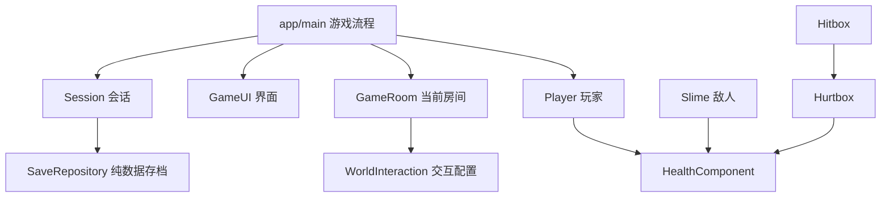

# 架构与编码规范

## 缚钟守望者二、三阶段修订（2026-09-29）

用户已认可一阶段与本体碰撞范围，因此本轮只改变二、三阶段技能。二阶段「追魂钟柱」在施法期间每隔0.42秒读取一次玩家位置，逐次留下三枚独立地面预警；每枚从生成起有完整1.05秒预警，再按顺序短暂爆发。玩家持续移动可躲开旧位置，但需要规划后续落脚点。三阶段「逆相围猎」在玩家两侧生成镜像幽魂，预警后错开0.2秒向对侧穿越；目标点在起手时锁定，幽魂不会跟踪玩家，完整穿越结束后Boss进入反击窗口。一阶段普通横扫、普通突进与碰撞盒保持原值。

机制参考《空洞骑士》Nightmare King Grimm 的连续 Flame Pillars 和 Sisters of Battle 的错峰交叉协同，但结合钟庭主题、美术和本项目玩家移动指标重新实现，没有复制第二关的升空落地焰浪。钟柱使用已登记的 arcane explosion，幽魂使用 Bringer 图集与 bell spell bolt；视觉只跟随技能状态，命中由EchoMark物理时钟和玩家Hurtbox处理。移动幽魂用扫掠查询检查实体墙，并沿位移段检测玩家，危险持续时间覆盖全程；装饰层不改变Boss身体碰撞。独立Boss套件覆盖独立落点、错峰、实际穿越伤害、护盾和生命周期。自动检查不代表真人已认可二、三阶段难度。

## 当前运行边界与后续接线

正式入口 `app/main.tscn` 注册三章共25个原生房间；第三关九房间的入口、门、地图/HUD、踏壁能力、钟庭之心、承重回桥、Boss胜利与存档已接入主线。`features/world/prototypes/bell_court_preview.tscn` 仍作为隔离试玩入口，进度只存在内存。第三关独立使用 `WallEcho`、`ResonantSlab`、`BellInvoker`、`BellSkimmer` 与 `BellWarden`，不复用前两章敌人阵容。

下一项是核验完整主线存档/旧档门槛与全量回归，并进行第三关真人难度递进、视觉和路线可读性验收。保留已认可的物理和原生手工地图；不得用自动测试代替真人难度验收。开发顺序与 Windows/Mac 边界见[交接](next-development.md)。下方按专题及版本保留演进记录，后续修订优先于历史实现。

## 杖使贴身反击的选招距离

真人再次指出第三关法师出反击却不掉血。根因不是抗打断吞伤害：上挑原图实体与其保守源帧轮廓位于外侧，内侧32–42px站位处确实打空；此前反击测试把玩家移到58px之后才检查掉血，漏掉固定贴身站位。现在InvokerConfig.rising_minimum=52px，进入近战WARNING之前，由_choose_arc选择：距离不足52px用已有回扫（最后一帧覆盖内侧），其余保留原两式轮换。技能选好后继续锁向，不改变原图、形状、伤害数值、前摇/生效/收招，不给空白处添加隐形伤害。

新增counter_damage_suite用固定站位、正常剑击、真实健康事件核对左右26/32/42/52px法师反击，明确事件发生在ACTIVE阶段；护盾检查同一次反击只消耗一次防护、无补伤。也复查第二关剑士/宝箱左右32/42/52px。旧enemy_stagger_suite取消为命中而后退到58px的走位。法师原生退步夹具改为正常走回被反击击退前的近身距离，再测试退步决策，不能因首次空挥不掉血的旧假设削弱真实反击。

## 小怪连续受击与还击修订

用户认可三章AI后指出小怪被连续攻击时无法还击，并明确其他内容无需调整。七类小怪原生场景新增EnemyStagger子节点，共享只读EnemyStaggerConfig，quiet_left仅属于实例；0.75秒没有新的有效伤害后恢复打断资格，物理时钟随暂停冻结。Health/Hurtbox仍先正常扣血，组件只决定这次命中是否能重置FSM；不增加生命、减伤、伤害免疫或必定反击。活铠甲原有不可打断的剑击准备/生效规则保留。

可打断阶段的首击继续受伤闪烁、原图受击动作并取消该次攻击；连续命中仍有伤害和命中反馈，但不重新计满硬直、不重复击退，也不取消当前已重新准备的法术/声刃。死亡始终立即关闭伤害和清理技能。第一下受击后直接返回原决策，而非额外接一整段未发生攻击的收招：杖使/铃翼受击为0.18秒，宝箱/剑士受击0.18秒；铠甲0.18秒、墨文0.22秒、史莱姆0.2秒保留。若命中发生在真实攻击收招阶段，保留剩余收招，不能因为抗打断缩短玩家已有反击窗口。

本节更新此前“每次受伤都取消技能”的描述：现在只有获准造成硬直的伤害才取消；致死伤害无条件清理。Boss、寻路/换位决策、攻击前摇和生效时长、地图、主角与存档不随本轮变更。enemy_stagger_suite用真实连续剑击验证剑士/宝箱/杖使存活后的完整预警、释放与实际玩家掉血，另测七类普通伤害、致死、暂停、实例隔离、停手后可再次打断及原收招窗口。

## 三章小怪决策修订（2026-09-27）

沿用各敌人自己的FSM，采用game-ai的决策与安全移动分离方法，没有引入通用AI框架。新增距离、记忆、耐心、冷却和追击上限放在对应Config Resource；已完成出招次数、最后看见的位置、锁定换位点和计时属于实例。敌人只读玩家当前位置、速度和实际落地状态，不读取按键、不预测未来输入；准备/生效/收招期间不重新选招或转向追打。

- 第一关：Slime超出巡逻范围时先朝出生区返回，使用方向性碰撞探测，取消逐帧位置微移和0.6秒强制重置身体命中名单；持续接触依靠原Hitbox的离开后重置。LivingArmor有0.65秒最后位置记忆和260px追击范围，正向碰撞查询让它能离开刚碰到的墙；丢失或死亡目标不产生盲目剑击。DoomScribe保持定点炮台，用与InkBolt相同5px半径的形状检查射路；首发保留教学，后续遇上升中的玩家最多等待0.35秒再进入完整蓄力，锁向后不追踪。
- 第二关：WingedChest增加APPROACH，170px感知内先以52px/s接近到110px再进入原0.7秒预警；安全检查覆盖墙、落脚与220px出生范围。RoseSentinel首轮保留后撤教学，之后72px内才主动后撤，已在合适距离或背后无安全空间时直接进入完整0.7秒预警。两者失去目标后安全返回驻点，剑士追击限260px；HP、伤害、突进速度和完整收招不变。
- 第三关：BellInvoker增加RETREAT，完成一次释放及完整收招后才允许在近身压力下后退，105px/s、最多0.42秒、冷却3秒；110–148px远程冷却期保持距离，失去目标仅搜索0.65秒然后返程。首轮远程按房间教学，后续静止落地目标优先咒印、移动/空中目标优先钟波，落地目标前同招连续两次后换招。BellSkimmer增加REPOSITION，空中贴近或连续两次俯冲后尝试短距离侧移；105px/s、最多96px/1秒、冷却3秒，不升高逃逸且保留完整低位收招。实际身体test_move检查俯冲/换位通道，两个敌人追击范围均240px。

新增bell_ai_suite与chapter_enemy_ai_suite使用独立场景与user://test_*路径。测试摆位与真实InputMap路线分别记录；默认统一check都执行两套决策测试，-Full再运行两章路线、跨进程保存与旧集成，-Visual检查原生房间中的新动作。地图、主角能力、Boss和正式存档结构没有随本轮AI调整改变。

## 飞行尖啸与踏壁易用性修订（2026-09-27）

BellSkimmer增加SCREECH_WARNING/ACTIVE/RECOVER三个FSM状态，SkimmerConfig保存只读时长/速度/扇角；自身持有EchoPulse世界坐标子节点。三道声刃和本次接触共享hit_ids，所有世界扫掠查询先于玩家伤害查询；获准打断、死亡或切房时撤销实例，连续受击不再无条件取消技能，以EnemyStagger规则为准。当前波未结束时不因离开身体重置同次接触列表。法师大小由InvokerConfig.sprite_scale统一驱动视觉与原图近战轮廓，原生场景盒子同步校准，世界脚底点不动。

WallEcho保留真实碰撞来源并增加限时/限距的接触记忆和向前探测：仅标记墙、未花费墙可保留早按；不会把普通墙变为壁跃面。壁跃按键可缓冲，不必在碰撞的同一帧触发；0.50秒自动向外移动、对墙接续0.18秒、离墙0.14秒，落地/受伤/菜单清理，普通跳跃主动结束辅助。共享Player只在wall_echo能力与标记墙条件下应用新规则。下方0.10秒控制保护等为初版历史，以本节及最新试玩说明为准。

## 第三关试玩反馈修订（2026-09-27）

试玩宿主接入原CombatFeedback，统一玩家/敌人impact并在切房清理。BellInvoker新增由自身持有的BellSpell世界坐标子节点，负责远程钟波和锁定地面的咒印，继续使用InvokerConfig只读参数、BellFrameStrike与Hurtbox防御链。技能与本次身体接触共用命中列表，受伤/死亡立即撤销，随房间销毁。没有改主线法术或第一二关敌人。Player的WallEcho只新增表现计时，SpriteFrames增加两段组合动作，PlayerVisualEffects监听壁跃信号生成无碰撞石屑；物理移动和旧能力预算不变。

## 第三关前半段试玩与独立敌人（2026-09-27）

新增五个原生GameRoom/TileMapLayer场景，由独立bell_court_preview宿主载入。宿主持有内存检查点、清场与回闩，不调用主线commit/restore；已有GameRoom.enabled=false由试玩宿主管理交互，正式Main和存档白名单保持原状。Player仍用原节点/配置，默认6生命继承双跳、冲刺、护盾，可用Baseline以5生命无盾验证。踏壁教学从448px压力竖井拆成两个224px段，中间宽台，实测每段3次蹬墙。门绑定稳定房间/出生点并验证上层双向返回。

BellInvoker与BellSkimmer分别独立FSM，组合Health/Hurtbox/ContactBox/BellFrameStrike及只读Resource。物理时钟直接选择SpriteFrames帧与当帧伤害轮廓；凹多边形分解查询保留法术内侧空区，World射线挡薄墙，接触与当前招式共享去重。ResonantSlab是踩压后延迟释放的四齿机关，一次释放共享去重，须离开再踩才能重启。正式数值/源帧映射、试玩边界与工具见[tasks/chapter_three_preview.md](tasks/chapter_three_preview.md)。两敌已导入原PNG和许可，Bringer Boss、后半章和持久化接线尚未实现。

## 第三关壁跃组件与独立白盒（2026-09-27）

Player组合WallEcho节点，配置WallEchoConfig只读；每次物理帧根据真实slide collision读取WallEchoSurface法线和稳定surface_id。普通旧墙不参与；连续墙块必须同ID。已解锁且MOVE状态下的新jump按键优先蹬墙，向外230px/s、沿用原跳跃初速、0.10秒横向控制保护；贴墙向内输入下落封顶80px/s。运行状态为当前接触、上一面实际使用的墙与控制剩余时间；只有落地或交替使用另一面墙才可再次使用原墙。空中双跳/冲刺次数不补充，攻击/HURT/DASH不能触发蹬墙；受伤/菜单清接触和控制但不返还已用墙，复活/死亡清理实例状态。

features/world/prototypes/echo_cloister_blockout.tscn为可编辑原生TileMapLayer场景，一次性工具遇已有文件拒绝重建。它独立F6启动，仅初始化本进程内的六HP与旧能力、领取新能力并开本地回闩；save/settings路径改为test_前缀且没有写入调用。没有主线房间注册、没有玩家进度迁移，没有把wall_echo加入正式存档白名单；正式章节接线时再联动迁移/跨进程验证。统一check先运行独立wall_echo_metrics，再运行原门禁；本轮共享Player变更已执行-Full -Visual。

## 第二关旧生命加成统一（2026-09-27用户追加确认）

Session.maximum_health只返回5加heart_bloom收益；cistern_heart保留为历史领奖/补steam_ward的依据，不再参与生命计算。有第一关生命花的第二关新旧档均为6HP，否则仍为5HP。存档不保存瞬时HP或独立上限，因此无需写玩家JSON；重新启动并继续现有进度时Player按新规则初始化，死亡/重试继续使用同一规则。普通存档依旧不回血；第三关规划的bell_heart尚未实现。

## 第二关旧修复档与首领进度分离（2026-09-27）

GameRoom仅按furnace_keeper_defeated移除炉心监守者，cistern_restored仅保留环境修复/停喷口和既有终点交互收益。仅修复的旧档仍生成首领、锁住左右出口并隐藏回忆交互；JourneyProgress与WorldMap指向未击败的炉心。Main的chapter_end在重复标记分支之前也检查首领胜利和清场，避免旧标记绕过战斗。实际获胜新增击败标记并保存，旧能力/生命/修复标记不删，不改schema或玩家文件。真正完成后可在可见场地x=860回忆练习；练习胜利刷新双门，不保存进度。本节是第二关存档修订；第三关正式进度另由对应稳定ID与存档白名单管理，独立试玩仍与主线存档隔离。

## 无招式文字与保存不回血（2026-09-27）

GameUI不再创建boss_hint，Main不把两个首领的cue_changed接到HUD；血条、阶段名称及源动画/材质/音效仍由原系统管理。检查点交互和前庭/炉心入口自动存档仅更新检查点并commit，不调用Health.restore_full，成功统一显示Progress saved。重复保存及失败不改变当前生命。复活、领取独立奖励与击败Boss的回血仍属于各自事件，不属于保存行为。未更改存档schema，当前HP仍不持久化，继续游戏与复活规则保持原样。

## 第二关骑士素材与蓄力清晰度（2026-09-27）

第二关普通敌人保留RoseSentinel/RoseConfig及原生场景路径，替换为Hero Knight 2铁盔剑士图集，避免改动地图实例和存档标识。tools/import_helm_knight.py仅更新该敌人的帧资源与来源记录，不重建Boss或地图。素材140px格、脚底y=83；10/7倍精灵×1.4倍镜头对应2倍源像素。Run图的躯干偏置由只读stride_sprite_offset校正，仅改变Sprite.offset。伤害仍由原状态与Hitbox管理；受击进入原RECOVER并播放独立hurt片段，不改变恢复时长、碰撞层或接触伤害。源包的纯白受击帧排除，运行时闪白遵循减少闪光选项。

粉色Boss的charge_tint取消红色最低亮度，保留原图暗线与明度层次；角色轮廓光缩为4px采样半径、0.7强度和(1.12,1.06)脉冲扩张，glow/ghost显式最近邻。不改变全身闪红、蓄力时长或物理碰撞。

## 王之剑庭与主角战斗特效（2026-09-27）

HollowWarden 的 CHARGED 仅在1.5秒召唤期间进入SWORD_COURT，通过Hurtbox.damage_guard阻挡真实剑击；该状态有金色蓄力调制，不显示文字招式提示。SwordCourt的summon_finished在第一轮进入LOCK时发出，首领立即解除保护、进入CHASE并清空普通攻击等待，不等第一柄飞剑发射。已生成的剑阵使用世界坐标保持独立；首领照常追击、横扫和突进，不由每轮飞剑事件改写身体动画。cast_finished仅清理引用并开始10秒再召唤冷却，不改变首领当前状态、动作或剩余计时。活动剑阵存在时禁止重复召唤，之后还需满足两次普通攻击门槛。

SwordCourtConfig保存只读配置：副剑360px/s、转向2.2rad/s，中央王剑400px/s、转向1.8rad/s，最长飞行2.2秒。每轮0.55秒（王剑0.7秒）无害瞄准保留清晰起始方向；FLIGHT每物理帧读取目标最新位置，以有上限的角速度改变飞行方向，并同步旋转精灵及ShapeCast2D。飞剑可追踪，但不会瞬间掉头或无限绕场。上一轮危险飞行结束后间隔0.18秒开下一轮，首领本体完全不等这套轮次时钟。暂停、目标死亡、首领死亡与换房清理仍由原父节点接线处理。

RoyalSword 使用用户提供的 IceButMelted Cast Spell 102 长剑图集，原PNG逐字节复制。召唤1–12、悬停13–17、飞行17、接触21–22、消散23–31；排除空白格。源图18–20含巨大烘焙挥砍光片，实机检查后排除；使用已落定剑身与碎光作为无害接触反馈，并保持来剑方向，触墙时将剑尖锚到实际接触点。真正飞剑使用稳定帧配合物理扫掠。ShapeCast2D 检测初始重叠和整段位移，World 优先阻挡；只有 FLIGHT 有伤害，同轮副剑共用已处理Hurtbox ID，下一轮另建列表。伤害同步触发死亡时尊重已退休状态，不复活消散图形。副剑和王剑在1.4倍固定镜头下分别对应1倍与2倍源像素。国王召唤使用attack2的0→1蓄力姿势；结束后立即交还正常动画控制，不再按每轮飞剑播放court_release。只有真实普通攻击生效时播放对应刀光。旧RoyalEcho/Earth素材留档，首领运行入口不再引用。

PlayerSlash 从已有课程 weapon_smears 图集读取真实刀光，Player 在攻击 ACTIVE 内调用 present，不使用独立播放时钟。每次独立攻击交替使用 hero 31→32→33 与34→35→36 的完整动作，对应刀光0–3与4–7；实例保存交替索引，复活重置，未新增自动连击。PlayerVisualEffects 用固定容量的 Sprite2D 池保存当前姿势的世界变换，生成青绿残影与轮廓光；材质仅影响像素，PlayerVfxConfig 只保存视觉数值。光晕采样限制在对应帧，纹理区域预留透明边缘。暂停继承玩家暂停；受伤、死亡、复活立即清空，切房通过 cancel_dash(true) 清空，正常冲刺结束允许短暂淡出。不修改剑击 Hitbox、移动配置、冲刺距离、伤害、无敌或存档。

800×450内部视口使用整数倍窗口缩放，默认1600×900，Canvas变换像素对齐。两个Boss精灵使用最近邻，Sprite倍率10/7与固定1.4倍镜头相乘得到2倍源像素显示；物理碰撞不缩放。charge_tint通过vertex varying保存调制色，避免fragment中重复乘入纹理使本体变暗。

左右手交替的输入语义：一次新按键只播放一手，下一次新按键换另一手；单按和长按均不会自动出第二手。PlayerConfig.attack_buffer_seconds默认为0.12秒，仅收招期间的新按键可缓冲一次续招；下一手在本手完整收招结束后开始。输入缓冲属于实例，受伤、死亡、复活、切房和菜单reset_input清空。两段末姿与下一段准备姿一致，连续出招不穿插idle。每手原有AttackProfile和伤害去重不变。

WingedChest在扑咬时让身体接触与咬击共享hit_ids，直到扑咬结束且两个区域均与玩家分离后恢复普通接触去重。护盾可挡住整个扑咬，不增加全局无敌；再次接触或下一次攻击仍会伤害。

默认与完整测试入口均运行 sword_court_suite / player_vfx_suite。截图126–133覆盖剑庭召唤、瞄准、飞行、裁决、落点与同时进行的普通攻击；117–125保留主角双手刀光与冲刺检查。royal_echo_suite仅保留旧UID兼容入口，实际转到新剑庭套件；完整回归范围见verification.md。

## 独立 Boss 挑战

主菜单经 GameUI 信号选择章节，Main 在内存中重置 Session 并授予测试能力，直接加载原生 Boss 房间。GameRoom 的 rehearsal 标记使已击败首领仍可实例化，并隐藏场内回忆交互。Main 在挑战中屏蔽房间交互及通关保存，死亡重载所选房间，胜利只打开再战菜单。返回标题时从原玩家存档恢复 Session；挑战期间不调用 commit。测试使用独立的 user://test_* 存档核对原始字节不变。

## 炉心监守者（0.14.0）

2026-09-27补充：攻击循环包含近身普攻和地面蓄力三连斩。空中WARNING在真实升空位置悬停2.2秒，VisualEffects仅推进轮廓光晕、世界残影与全身红色材质，不改变物理位置；减少闪光设置使用稳定低强度红色。下砸中心与双墙共享实例级已处理目标列表，图形结束同步关闭中心伤害。火墙高210px，站在平台仍可受伤，登台起跳才可越过。

FurnaceKeeper 是独立 CharacterBody2D，组合 Health/Hurtbox 和只读 FurnaceConfig，物理帧状态机管理锁向突进斩、短跳换位、升空悬停、垂直下砸、泄压和转阶段。独立 DashHitbox 复用单次挥击去重和护盾处理。FurnaceFlame 是首领子节点 Area2D，负责落点爆发、双向焰浪横移、单次命中和释放；命中走 Hurtbox.resolve_hit，继承护盾抵挡语义。视觉 Sprite 与碰撞形状分离。GameRoom 在加载时仅按 furnace_keeper_defeated 过滤首领，并向 Main 转发事件；Main 负责血条、唯一击败标记、保存及通关交互。真实击败后可用 challenge 交互开启回忆战，rehearsal 状态只在当前房间实例中存在，不写存档。旧 cistern_restored 仅保留水道修复成果；schema仍为2，地形 TileMapLayer 与桌面素材未重建或修改。

## 基线

0.13.0将秘库奖励改为steam_ward能力。第二关仍为七个持久化原生房间，地图几何不变。SaveRepository扩展能力白名单，schema仍为2；旧cistern_heart仅用于识别历史领奖并补发护盾，不再增加生命上限，新领取不再添加此标记。实例状态不写配置，桌面源素材不修改。地图工具拒绝覆盖已保存场景；第二关敌人集合与第一关不重叠，由回归自动检查。

### 水闸回响（0.13.1）

Player组合SteamWard子节点，SteamWardConfig保存1.5s防护、5s启动冷却和0.3s抵挡反馈。Player在物理帧推进计时并读取InputMap steam_ward；暂停冻结、切房取消充能但保留冷却、死亡取消、复活重置。按键需释放后重新按下；受伤硬直不可启动，移动/跳跃/剑击/冲刺可同时使用。SteamWard的status_changed由Main接到HUD，仅状态或显示秒数改变时更新文字；圆环仅绘制，无碰撞或全局无敌。

SteamVent在真实ACTIVE重叠时尝试消耗一次充能；成功后仅记录该Player实例ID，在本喷口当前喷发期间忽略其后续伤害，阶段转换/停用清空记录。已有伤害无敌期不消耗技能。没有新Autoload、纹理或外部依赖。

0.13.1由Player将steam_ward.absorb注入自身Hurtbox.damage_guard；敌人Hurtbox不绑定防护。resolve_hit先检查生命/伤害/无敌，再返回IGNORED、DAMAGED或BLOCKED。Hitbox将实际伤害与抵挡均记入本次挥击的hit_ids，只有DAMAGED发landed/impact，避免同一刀次帧补伤与假受伤反馈。receive_hit仍保持“实际扣血才true”的原契约，InkBolt通过它消耗护盾且照常销毁弹体，不产生伤害反馈。护盾damage_blocked信号表示已发生的抵挡，HUD沿用status_changed；不引入全局无敌。越界复活用Health直接结算，不受护盾阻碍。

保存只持久化steam_ward解锁，不保存瞬時計时。迁移先深复制并校验旧schema2，只有合法cistern_heart标记才补发能力，保留能力与第一关生命花收益；重复迁移无重复条目，未来/非法档不补发。玩家文件只在正常游戏保存时更新，测试使用隔离路径。新奖励回满当前上限生命、唯一隐藏、沿用保存失败提示与祭坛重试。

SettingsRepository校验原配置类型后，InputBindings.with_ward_defaults为旧设置中被占用的L/LB选择空闲设备槽；不改旧动作。显式技能绑定仍遵守冲突检测。Session正常保存时持久化补齐后的配置，HUD和领奖说明均显示实际映射。

- Godot 4.7.2 标准版 / GDScript / Compatibility / 60 Hz 物理。
- 800×450 基准视口、1440×810 初始窗口；像素纹理使用最近邻，普通房间与 Boss 房间均使用 1.4 倍镜头。
- 场景与脚本按功能放在一起；配置 `.tres` 与原生 `.tscn` 可在编辑器修改。
- 默认无第三方运行依赖。Python 工具只用标准库；PowerShell 提供 Windows 入口。

## 依赖方向

`main.gd` 只负责加载房间、接线、暂停、复活与保存触发；不承担角色物理或敌人 AI。
子场景向上发信号；HUD 监听生命和进度变化，不每帧查血量。房间通过信号提交交互请求，不直接保存或切换场景。
仅 `Session`、`Audio` 两个 Autoload：跨房间进度和声音。当前玩家读取 Session 已解锁能力，是明确的轻量全局依赖；若增加多玩家再抽取能力组件。

## 场景职责

| 模块 | 职责 | 不负责 |
|---|---|---|
| Player | MOVE/ATTACK/HURT/DEAD/DASH 状态、输入、速度、动画选择 | 加载地图、写存档 |
| PlayerConfig | Inspector 可调静态数值；按高度/时间推导重力 | 当前 HP、当前速度 |
| AttackProfile | 准备/生效/收招及伤害，共用阶段计算 | 每次攻击的经过时间 |
| HealthComponent | 扣血、无敌时间、死亡、变化事件 | 镜头、UI、存档 |
| Hitbox / Hurtbox | 碰撞筛选、同一挥击目标去重、传递伤害 | 判定游戏胜利 |
| Slime | PATROL/HURT/DEAD 状态，墙/边缘检测 | 复杂寻路、全局关卡进度 |
| LivingArmor / ArmorConfig | 七状态 FSM、目标视线、方向锁定、可调攻击/感知参数 | 房间切换和存档 |
| HollowWarden / WardenConfig | 九状态首领 FSM、交替攻击、半血阶段、独立数值 | 保存进度、打开结局、控制镜头 |
| DoomScribe / ScribeConfig | 六状态 FSM、视线、锁定瞄准、可打断施法、数值 | 管理弹体生命周期 |
| WingedChest / ChestConfig | 五状态FSM、视线、方向锁定、短距扑咬、墙/边缘保护 | 全局进度、奖励或存档 |
| RoseSentinel / RoseConfig | 七状态FSM、接近/后撤/锁向突斩/收招、墙与边缘保护 | 复用第一关敌人行为、保存进度 |
| InkBolt | 半径 5px ShapeCast2D 扫掠、一次命中、寿命、释放 | 追踪玩家、保存自己 |
| CombatFeedback / ImpactEffect | 命中信号驱动短暂粒子、镜头偏移和声音 | 改变物理位置、全局时间 |
| GameRoom | 房间元数据、出生点、附近交互、原生地图 | 直接持久化 |
| WindGate | 实体风障、碰撞关闭、breached 信号 | 直接保存、修改玩家能力 |
| WorldMap / GameUI | 房间关系图、探索/存档/奖励标记、原生地图面板与按钮焦点 | 传送玩家、写存档、改变房间几何 |
| SaveRepository | 版本验证、读写、临时文件、备份恢复 | 访问场景节点 |

## 物理与时序

| 层编号 | 名称 | 使用方 |
|---|---|---|
| 1 | World | TileMapLayer、边界；玩家/敌人物体扫描 |
| 2 | Player body | 玩家 CharacterBody2D |
| 3 | Enemy body | 敌人 CharacterBody2D |
| 4 | Player hurtbox | 敌方 Hitbox 扫描 |
| 5 | Enemy hurtbox | 玩家 Hitbox 扫描 |
| 6 | Interaction | 预留；当前用近距离+交互按键选择 |

移动、重力、状态计时与攻击重叠处理在物理帧。渲染只负责背景、动画表现、镜头与 UI。
玩家与敌人实体只扫描世界；接触伤害通过独立 Area2D，不靠实体互相挤压。
攻击区始终监测，只在生效窗口应用伤害；每次 `begin_swing()` 清空命中集合。
`begin_swing()` 不自动开启伤害；调用方显式设置 active。墙体射线从角色身体横坐标、攻击框高度到目标受击形状中心；只查询 World 层。
Hitbox 命中后发出 impact，主场景把玩家/活铠甲事件接到本地 Feedback 节点。玩家受伤自带音效，因此敌人事件仅增加视觉反馈，避免重复音效。
Feedback 随场景暂停，换房 clear 清理粒子/镜头偏移；没有新增 Autoload，也没有修改 Engine.time_scale。
GameRoom 接收 DoomScribe.cast_requested，在本房间 Projectiles 节点下生成 InkBolt，并把 impact 向 Main 转发；Main 将目标 Player 注入敌人。
弹体起点在施法者身体内，不能越过贴身墙；每物理帧先检测初始重叠，再扫掠整段位移，mask=9（World + Player hurtbox）。最近碰撞只结算一次，无敌目标也消耗弹体；同距离墙体优先。
施法开始锁定方向，不在飞行中追踪。受击立即打断准备，死亡取消该施法者已发出的弹体；玩家死亡清空当前房间所有弹体并禁用发射，切房销毁整个旧房间。暂停冻结弹体位移和寿命。
暂停时 Main 保持运行以接收恢复输入，Player 和 RoomHost 明确设为 Pausable。
地图复用暂停机制，记录打开前的暂停状态和菜单类型；关闭时返回原暂停/完成菜单或恢复游戏。打开与关闭时重置玩家输入，忽略按键重复事件；不会把地图里的长按带回跳跃或攻击。
冲刺在物理帧通过 move_and_slide 移动，末帧按剩余时长缩短速度，固定参数下总位移 111.6px。冲刺期间冻结垂直速度、锁定朝向，不开启攻击与无敌；普通墙终止冲刺。地面恢复空中次数只在非 DASH 状态执行，防止地面冲出边缘后再次空中冲刺。
风障属于 World 层 StaticBody2D；玩家实际冲刺碰撞命中 WindGate 后调用 breach。障碍延迟关闭 CollisionShape2D，信号经 GameRoom 向 Main 传递后设置标记并保存。普通步行/跳跃/剑击不能打开。风障 960px 高，封住房间上方越界绕过路线；视觉只绘制可见的 480px。
切房、伤害、死亡取消冲刺；复活清理计时器/空中次数，暂停冻结计时。冲刺冷却和剩余时长均是实例状态，参数属于 PlayerConfig。线条拖尾只绘制，不更改物理形状。

## 命名、类型与变更边界

- 文件/函数/变量使用 snake_case，注册类 PascalCase，常量 UPPER_SNAKE_CASE。
- 导出字段、信号参数、公共方法及核心变量写类型；可明确推断时用 `:=`。
- `@onready` 绑定固定子节点；跨房间使用稳定 room/spawn/ability ID，不保存 NodePath。
- 设计配置只读，运行时实例状态独立；修改共享资源前先复制。
- 节点销毁使用 queue_free；销毁后的异步回调注意有效性。
- 不为两个状态引入通用行为树框架；状态较少时使用枚举和集中转移。
- 修改范围按功能收敛：改变跳跃配置时必须复测平台可达性；改变存档结构时必须设计迁移。
- GDScript 缩进 Tab、UTF-8、LF；引擎生成的长场景行不手工换行。

## 存档契约

`user://progress_v1.json` 保留旧路径，当前 schema 2 保存 version、checkpoint_room、checkpoint_spawn、abilities、visited、completed、flags。
schema 1 读取后复制数据、补 flags=[] 并升级版本，再校验；不原地改玩家文件，下一次正常保存才写 schema 2。旧备份也走迁移。
有效房间为 forest / ruins / training / scriptorium / sanctuary；forest、ruins、sanctuary 检查点为 checkpoint，training、scriptorium 支持 checkpoint 与 rest（中途休息处）。flags 接受 training_cleared / scriptorium_cleared / heart_bloom。
0.5.0 新增 wind_hall、belfry 房间（均仅 checkpoint）、dash 能力、wind_passage_open 与 belfry_cleared 标记；仍使用 schema 2，原字段与旧 schema 1/2 样本保留兼容。开风障和点亮信标也是保存触发点。
0.3.0 和 0.4.0 只扩展稳定 ID 白名单，数据字段结构不变，仍用 schema 2；旧 schema 2 原样读取，schema 1 迁移继续有效。不保证旧游戏版本能加载含新房间 ID 的新进度。
生命上限由 Session.maximum_health() 从 heart_bloom 标记推导（默认 5，获得后 6），不另存可冲突的数值。领取时、玩家创建和复活时同步 HealthComponent；奖励唯一且领取后隐藏。
地图读取 Session.visited；切房更新会话探索记录，只有正常保存触发时落盘。打开地图、退出程序本身不触发自动保存。
不保存瞬时坐标、当前攻击、敌人实例和当前 HP；恢复时出生在存档点并回满生命。
先写 `.tmp` 并 flush，再保存有效旧文件为 `.bak`，最后替换主文件。校验失败回退备份；不宣称 Windows 文件替换绝对原子。
仅合法房间/出生点/能力 ID 可加载。未来版本拒绝；变更 schema 必须添加迁移和旧版样本测试。
辅助设置独立写入 `user://settings.cfg`，不随新游戏清空。测试使用独立设置路径，不覆盖玩家设置。

## 语言与奖励反馈（0.6.0）

TextCatalog 集中维护英文源文本到简体中文的映射，在 Session 启动时注册原生 Translation；语言只接受 en / zh_CN。Session.language_changed 驱动现有界面更新，不新增 Autoload。语言存入 user://settings.cfg 的 interface/language，独立于游戏进度，新游戏不清空语言。
GameUI 保存动态 Label 的原文，通过 set_text 更新；语言切换同步刷新房间名、交互、HUD、提示、地图和未消失的奖励卡片。菜单重建保留 Continue 是否可用和语言按钮焦点，暂停状态不改变。原英文像素字体保留，中文模式使用随工程携带的 Noto Sans CJK SC；英文模式为双语语言按钮配置中文后备字体。
RewardNotice 使用原生 PanelContainer/VBoxContainer，统一显示能力、生命之花、封印和信标效果。只在真实领取后由 Main 保存并传入成功/失败结果，不自行写存档；普通提示不能覆盖卡片。6 秒只计算可见游戏时间，暂停/地图期间隐藏并冻结；不抢焦点、不暂停游戏。已有标记的奖励拒绝重复发放/重复提示。
测试使用独立 test_ui_settings_<pid>.cfg 与 test_language_cross_process.cfg，不覆盖玩家语言设置。字体及授权文件有 SHA-256 记录；导出预设包含字体授权文本，尚未实际执行导出。

## 原生内容编辑

### 第二关素材统一（0.10.1）

第二关四房间通过一次性的 tools/dress_cistern 美术迁移，保存独立 cistern_tileset.tres 与 brazier_frames.tres；原 forest.png 不变。Terrain 原有占用格分别120/210/124/120，仍是32px完整碰撞格。CastleArt 下为禁用碰撞的原生背景 TileMapLayer、静态Sprite和火盆AnimatedSprite2D；正式运行不创建或修改地图。

原型 Backdrop/CisternLandmarks 节点由原图砌石、石拱、水面等取代，关卡各有陈设。各出口保持原 WorldInteraction 脚本与配置，ForgeDoor 图片子节点替换门的几何绘制，条件颜色提示仍读原门槛。新 door_and_switch/props_destructible PNG 来自同一课程包，最近邻显示、无mipmap，清单记录源路径和摘要。

迁移检测 CastleArt 后拒绝重跑，日常编辑已保存场景。样式规范见 art_direction.md；无新增存档字段、插件或Autoload。所有装饰无碰撞，入口/奖励/台阶和玩家参数保持原规则。

### 第二关（0.10.0）

新增 ember_quay / valve_gallery / cistern_archive / furnace_core 四个 1280×576 房间，共十三房间。全部是独立原生 TileMapLayer 场景；tools/build_chapter_two 只负责首次按显式坐标制作，任一目标文件已存在便拒绝执行，日常直接编辑场景。

SteamVent 是 Area2D，mask=Player body，独立 REST/WARNING/ACTIVE 状态与 elapsed；SteamConfig 为只读 Resource（2.4s 停歇、1s 预警、1s 喷发、64×80px、1伤害）。碰撞形状和视觉从同一 plume_size 得到；不移动碰撞、不改 Engine.time_scale，不读取或写入存档。暂停由房间父节点的 Pausable 继承。GameRoom 根据 cistern_restored 停用喷口，下一次进房同样有效。

WorldInteraction 新增 visible_after_flag、interaction_radius 和 chapter_end 类型；父房间更新可见性，Main 判断清场、唯一标记、回血、保存并打开章节结束界面。第一关入口使用 32px 半径，防止与最终回响的 64px 交互范围混淆。炉心入口把重试点设为 ember_quay/checkpoint，保存失败仍如实显示。

WorldMap 保留第一章关系并增加第二页，当前房间决定初始页，可通过原生按钮切换。页面清单分别读三印或双阀/炉心，不增加存档状态。JourneyProgress 在第一关完成后引导至第二关，随后根据双阀与章节完成标记推导目标。

SaveRepository schema 仍为 2，增加上述四房间（checkpoint）及 flow_seal / pressure_seal / cistern_restored 白名单，保留旧版样本与迁移。不保存喷口时钟；重新进房从安全停歇开始。既有角色/敌人配置未改变，无新增 Autoload 或美术资产。

### 第一关打磨（0.9.0）

InputBindings 为 Session 持有的 RefCounted，捕获工程默认 InputMap；重绑只替换对应设备槽，保留摇杆和另一类设备。拒绝冲突、修饰键组合与菜单保留键，ESC/Start 始终用于暂停。Main 观察真实输入并更新设备，UI 通过 changed 信号刷新。TextCatalog 先翻译再经 Callable 格式化交互/能力按键，避免工具模式直接依赖 Autoload 编译顺序。

SettingsPanel 为独立原生 PanelContainer + ScrollContainer，与原菜单分别显示，滚动随焦点；Main 在捕获期间阻断玩法/地图/静音快捷键。退出设置返回调用菜单且不解除暂停；新游戏用 ConfirmationDialog 明确确认。settings.cfg 的 meta/version=1，保留原 accessibility/interface 字段并加入 audio/display/input；SettingsRepository 兼容无版本旧文件，校验范围/类型/映射冲突，临时文件 flush 后备份有效主档再替换，损坏回退 .bak。Windows 不承诺绝对原子替换，游戏进度 schema 2 不变。

Music/SFX 分别应用线性音量转 dB，0 使用 bus mute；全屏仅生产主场景启动或用户操作时应用，测试保存设置不触碰玩家配置。现有 WAV 通过不同 pitch/gain 复用为 Boss 预警、转阶段、胜利声音，没有新增素材。cue_changed保留为首领事件，但不再显示为HUD文字；dash_status_changed 由玩家实例状态变化驱动 HUD；VitalityPips 由 health.changed 驱动。不通过 UI 改物理位置。

WorldMap 从既有 flags/abilities/visited 推导三印进度、目标和门槛；只有已知来源房间的门槛显示，未知名称仍隐藏。普通铠甲独立 SpriteFrames 采用与已核对图集一致的帧段，配置和碰撞不变。tests/chapter_route 仅通过 InputMap 行动，开局/读档外不修改运行时玩法状态。

### 首领与最终回响（0.8.0）

HollowWarden 为独立 CharacterBody2D，组合现有 Health/Hitbox/Hurtbox；不继承普通铠甲逻辑。WardenConfig 与三个 AttackProfile 为只读资源，阶段、计时、朝向、攻击次数均为实例状态。第一阶段交替横扫/突进；第二阶段循环蓄力重斩、横扫、突进。重斩使用国王 attack2 动画与独立宽命中区，蓄力全身红色提示；只有挥剑窗口造成伤害。半血只在收招结束后转入无伤害阶段提示，二阶段增加追击速度、收招乘 0.85，不缩短预警。
Main 注入 Player，接 awakened/health.changed/phase_changed 驱动原生首领栏；击败信号延迟到安全时机，并核对房间实例、玩家仍活着与标记唯一性，再回血、保存和显示奖励。玩家死亡关闭血条，Boss 下一物理帧关闭攻击；切房释放整个实例。双方同帧死亡按失败重试，旧房间延迟胜利不影响新房间。
进入 heart_chamber 前把 checkpoint 固定到 atrium/checkpoint 并尝试保存；保存失败显示原提示，会话检查点仍可重试。两个首领房都使用固定单屏镜头；进场后入口实体边界保持封闭，战斗中不显示返回门，击败首领后只显示中央出口。
GameRoom 在装载时移除已有 warden_defeated 标记的首领；Boss 房战斗期间不显示出口，击败后第一关显示左侧返回前庭与右侧第二关门，第二关显示左侧返回渡口与右侧章节出口。结局按实际保存结果展示成功/失败，菜单支持继续探索、语言切换及地图往返。重复交互不重复播放；保存失败后可到祭坛重试。
schema 2 不变，增加 heart_chamber 与 warden_defeated/journey_restored 白名单。completed 仍表示旧高台事件，绝不自动迁移成新结局；主线结局以 journey_restored 为准。不持久化首领半血或攻击阶段，未击败则重入满血。
heart_chamber.tscn 是原生 640×576 房间，连续平地 y=480；tools/build_heart_chamber.tscn 只首次创建并拒绝覆盖。复用原铠甲PNG与图块，无新增 Autoload、外部素材或依赖。
0.8.1守门者改用独立warden_frames.tres修正选帧，_play_clip按实际片段帧数/fps匹配阶段时间，每次显式从头播放。待机/入场/转阶段使用循环idle；2倍最近邻显示仅影响Sprite，脚底y=0，Body/Hurtbox/AttackBox与配置不改，普通铠甲共用资源不改。

### 主线汇合（0.7.0）

JourneyProgress 是无节点、无副作用的目标推导器，只读取 abilities/flags/visited；GameUI 在既有 progress_changed 事件中更新文本，不增加任务存档或 Autoload。completed 仍兼容表示高台纪念事件，不表示正式结局，也不是前庭门槛。
WorldInteraction 新增可编辑 required_flags 与对应 missing_flag_prompts；locked_message 统一验证原单能力/单标记与新增多标记门槛。Main 负责拒绝/提示或延迟切房。森林 ConvergenceDoor 子脚本仅绘制三个槽位，条件保存在原生场景中，不改变碰撞。
回响前庭稳定 ID 为 `atrium`，仅支持 checkpoint 存档；schema 2 字段不变、只增加房间白名单。旧档已有三印即可通行，前庭入口不要求生命奖励或旧 completed。跨进程样本保存八房间探索和前庭检查点。
atrium.tscn 为 960×576 原生房间，敌人为空，地面 y=480、平台 y=416/352、存档 x=240。Landmarks 只绘制背景和内门，正式运行不依赖生成器；tools/build_atrium.tscn 仅供首次创建并拒绝覆盖已存在房间。

房间几何已经烘焙为 `TileMapLayer.tile_map_data`，正式运行不依赖 Python 或生成器。
直接在 Godot 编辑 `features/world/rooms/*.tscn`。`create_initial_scenes.py` 和 `bake_initial_rooms.gd` 是首次建库记录，不是日常构建任务，会拒绝覆盖已有内容。
HUD 当前通过脚本组合原生 Control/Container；没有 HTML 或模拟按钮。后续美术频繁编辑时可提取为 `.tscn`。
新增 training.tscn 同样使用可编辑 TileMapLayer；`tools/build_training_room.tscn` 仅保留首次创建记录，检测到房间已存在会拒绝覆盖。日常直接编辑房间场景。
scriptorium.tscn 为原生 1600×576 场景；`tools/build_scriptorium.tscn` 和 `build_scribe_assets.py` 是拒绝覆盖的首次建库工具。背景 room_width 导出字段匹配新房间宽度，其他房间默认保持 1280。
sanctuary.tscn 为原生 960×576 场景，三级平台、存档点与唯一奖励均可在编辑器修改；`tools/build_sanctuary.tscn` 仅是拒绝覆盖的首次创建记录。
WorldMap 在原生 Control 内绘制示意房间关系，位置不等于世界坐标；未探索相邻房间只显示 UNEXPLORED，秘境线索在获得二段跳后显示。已解锁捷径须两端都已探索才绘制，并用箭头标注返回方向。
wind_hall / belfry 分别为 960×576 / 1280×576，原生 TileMapLayer 场景；tools/build_wind_rooms.tscn 是拒绝覆盖的首次建库记录，后续直接编辑场景。WindLandmarks 提供地面/掩体背景填充、风旗和钟的纯视觉轮廓。地图上层新增秘境—风廊—钟楼路线，钟楼信标解锁单向回森林线。
