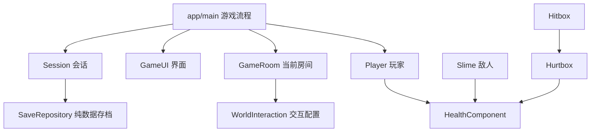

# 架构与编码规范

## 基线

- Godot 4.7.2 标准版 / GDScript / Compatibility / 60 Hz 物理。
- 640×360 基准视口、1280×720 初始窗口；像素纹理使用最近邻。
- 场景与脚本按功能放在一起；配置 `.tres` 与原生 `.tscn` 可在编辑器修改。
- 默认无第三方运行依赖。Python 工具只用标准库；PowerShell 提供 Windows 入口。

## 依赖方向

`main.gd` 只负责加载房间、接线、暂停、复活与保存触发；不承担角色物理或敌人 AI。
子场景向上发信号；HUD 监听生命和进度变化，不每帧查血量。房间通过信号提交交互请求，不直接保存或切换场景。
仅 `Session`、`Audio` 两个 Autoload：跨房间进度和声音。当前玩家读取 Session 已解锁能力，是明确的轻量全局依赖；若增加多玩家再抽取能力组件。

## 场景职责

| 模块 | 职责 | 不负责 |
|---|---|---|
| Player | MOVE/ATTACK/HURT/DEAD/DASH 状态、输入、速度、动画选择 | 加载地图、写存档 |
| PlayerConfig | Inspector 可调静态数值；按高度/时间推导重力 | 当前 HP、当前速度 |
| AttackProfile | 准备/生效/收招及伤害，共用阶段计算 | 每次攻击的经过时间 |
| HealthComponent | 扣血、无敌时间、死亡、变化事件 | 镜头、UI、存档 |
| Hitbox / Hurtbox | 碰撞筛选、同一挥击目标去重、传递伤害 | 判定游戏胜利 |
| Slime | PATROL/HURT/DEAD 状态，墙/边缘检测 | 复杂寻路、全局关卡进度 |
| LivingArmor / ArmorConfig | 七状态 FSM、目标视线、方向锁定、可调攻击/感知参数 | 房间切换和存档 |
| DoomScribe / ScribeConfig | 六状态 FSM、视线、锁定瞄准、可打断施法、数值 | 管理弹体生命周期 |
| InkBolt | 半径 5px ShapeCast2D 扫掠、一次命中、寿命、释放 | 追踪玩家、保存自己 |
| CombatFeedback / ImpactEffect | 命中信号驱动短暂粒子、镜头偏移和声音 | 改变物理位置、全局时间 |
| GameRoom | 房间元数据、出生点、附近交互、原生地图 | 直接持久化 |
| WindGate | 实体风障、碰撞关闭、breached 信号 | 直接保存、修改玩家能力 |
| WorldMap / GameUI | 房间关系图、探索/存档/奖励标记、原生地图面板与按钮焦点 | 传送玩家、写存档、改变房间几何 |
| SaveRepository | 版本验证、读写、临时文件、备份恢复 | 访问场景节点 |

## 物理与时序

| 层编号 | 名称 | 使用方 |
|---|---|---|
| 1 | World | TileMapLayer、边界；玩家/敌人物体扫描 |
| 2 | Player body | 玩家 CharacterBody2D |
| 3 | Enemy body | 敌人 CharacterBody2D |
| 4 | Player hurtbox | 敌方 Hitbox 扫描 |
| 5 | Enemy hurtbox | 玩家 Hitbox 扫描 |
| 6 | Interaction | 预留；当前用近距离+交互按键选择 |

移动、重力、状态计时与攻击重叠处理在物理帧。渲染只负责背景、动画表现、镜头与 UI。
玩家与敌人实体只扫描世界；接触伤害通过独立 Area2D，不靠实体互相挤压。
攻击区始终监测，只在生效窗口应用伤害；每次 `begin_swing()` 清空命中集合。
`begin_swing()` 不自动开启伤害；调用方显式设置 active。墙体射线从角色身体横坐标、攻击框高度到目标受击形状中心；只查询 World 层。
Hitbox 命中后发出 impact，主场景把玩家/活铠甲事件接到本地 Feedback 节点。玩家受伤自带音效，因此敌人事件仅增加视觉反馈，避免重复音效。
Feedback 随场景暂停，换房 clear 清理粒子/镜头偏移；没有新增 Autoload，也没有修改 Engine.time_scale。
GameRoom 接收 DoomScribe.cast_requested，在本房间 Projectiles 节点下生成 InkBolt，并把 impact 向 Main 转发；Main 将目标 Player 注入敌人。
弹体起点在施法者身体内，不能越过贴身墙；每物理帧先检测初始重叠，再扫掠整段位移，mask=9（World + Player hurtbox）。最近碰撞只结算一次，无敌目标也消耗弹体；同距离墙体优先。
施法开始锁定方向，不在飞行中追踪。受击立即打断准备，死亡取消该施法者已发出的弹体；玩家死亡清空当前房间所有弹体并禁用发射，切房销毁整个旧房间。暂停冻结弹体位移和寿命。
暂停时 Main 保持运行以接收恢复输入，Player 和 RoomHost 明确设为 Pausable。
地图复用暂停机制，记录打开前的暂停状态和菜单类型；关闭时返回原暂停/完成菜单或恢复游戏。打开与关闭时重置玩家输入，忽略按键重复事件；不会把地图里的长按带回跳跃或攻击。
冲刺在物理帧通过 move_and_slide 移动，末帧按剩余时长缩短速度，固定参数下总位移 111.6px。冲刺期间冻结垂直速度、锁定朝向，不开启攻击与无敌；普通墙终止冲刺。地面恢复空中次数只在非 DASH 状态执行，防止地面冲出边缘后再次空中冲刺。
风障属于 World 层 StaticBody2D；玩家实际冲刺碰撞命中 WindGate 后调用 breach。障碍延迟关闭 CollisionShape2D，信号经 GameRoom 向 Main 传递后设置标记并保存。普通步行/跳跃/剑击不能打开。风障 960px 高，封住房间上方越界绕过路线；视觉只绘制可见的 480px。
切房、伤害、死亡取消冲刺；复活清理计时器/空中次数，暂停冻结计时。冲刺冷却和剩余时长均是实例状态，参数属于 PlayerConfig。线条拖尾只绘制，不更改物理形状。

## 命名、类型与变更边界

- 文件/函数/变量使用 snake_case，注册类 PascalCase，常量 UPPER_SNAKE_CASE。
- 导出字段、信号参数、公共方法及核心变量写类型；可明确推断时用 `:=`。
- `@onready` 绑定固定子节点；跨房间使用稳定 room/spawn/ability ID，不保存 NodePath。
- 设计配置只读，运行时实例状态独立；修改共享资源前先复制。
- 节点销毁使用 queue_free；销毁后的异步回调注意有效性。
- 不为两个状态引入通用行为树框架；状态较少时使用枚举和集中转移。
- 修改范围按功能收敛：改变跳跃配置时必须复测平台可达性；改变存档结构时必须设计迁移。
- GDScript 缩进 Tab、UTF-8、LF；引擎生成的长场景行不手工换行。

## 存档契约

`user://progress_v1.json` 保留旧路径，当前 schema 2 保存 version、checkpoint_room、checkpoint_spawn、abilities、visited、completed、flags。
schema 1 读取后复制数据、补 flags=[] 并升级版本，再校验；不原地改玩家文件，下一次正常保存才写 schema 2。旧备份也走迁移。
有效房间为 forest / ruins / training / scriptorium / sanctuary；forest、ruins、sanctuary 检查点为 checkpoint，training、scriptorium 支持 checkpoint 与 rest（中途休息处）。flags 接受 training_cleared / scriptorium_cleared / heart_bloom。
0.5.0 新增 wind_hall、belfry 房间（均仅 checkpoint）、dash 能力、wind_passage_open 与 belfry_cleared 标记；仍使用 schema 2，原字段与旧 schema 1/2 样本保留兼容。开风障和点亮信标也是保存触发点。
0.3.0 和 0.4.0 只扩展稳定 ID 白名单，数据字段结构不变，仍用 schema 2；旧 schema 2 原样读取，schema 1 迁移继续有效。不保证旧游戏版本能加载含新房间 ID 的新进度。
生命上限由 Session.maximum_health() 从 heart_bloom 标记推导（默认 5，获得后 6），不另存可冲突的数值。领取时、玩家创建和复活时同步 HealthComponent；奖励唯一且领取后隐藏。
地图读取 Session.visited；切房更新会话探索记录，只有正常保存触发时落盘。打开地图、退出程序本身不触发自动保存。
不保存瞬时坐标、当前攻击、敌人实例和当前 HP；恢复时出生在存档点并回满生命。
先写 `.tmp` 并 flush，再保存有效旧文件为 `.bak`，最后替换主文件。校验失败回退备份；不宣称 Windows 文件替换绝对原子。
仅合法房间/出生点/能力 ID 可加载。未来版本拒绝；变更 schema 必须添加迁移和旧版样本测试。
辅助设置独立写入 `user://settings.cfg`，不随新游戏清空。测试使用独立设置路径，不覆盖玩家设置。

## 原生内容编辑

房间几何已经烘焙为 `TileMapLayer.tile_map_data`，正式运行不依赖 Python 或生成器。
直接在 Godot 编辑 `features/world/rooms/*.tscn`。`create_initial_scenes.py` 和 `bake_initial_rooms.gd` 是首次建库记录，不是日常构建任务，会拒绝覆盖已有内容。
HUD 当前通过脚本组合原生 Control/Container；没有 HTML 或模拟按钮。后续美术频繁编辑时可提取为 `.tscn`。
新增 training.tscn 同样使用可编辑 TileMapLayer；`tools/build_training_room.tscn` 仅保留首次创建记录，检测到房间已存在会拒绝覆盖。日常直接编辑房间场景。
scriptorium.tscn 为原生 1600×576 场景；`tools/build_scriptorium.tscn` 和 `build_scribe_assets.py` 是拒绝覆盖的首次建库工具。背景 room_width 导出字段匹配新房间宽度，其他房间默认保持 1280。
sanctuary.tscn 为原生 960×576 场景，三级平台、存档点与唯一奖励均可在编辑器修改；`tools/build_sanctuary.tscn` 仅是拒绝覆盖的首次创建记录。
WorldMap 在原生 Control 内绘制示意房间关系，位置不等于世界坐标；未探索相邻房间只显示 UNEXPLORED，秘境线索在获得二段跳后显示。已解锁捷径须两端都已探索才绘制，并用箭头标注返回方向。
wind_hall / belfry 分别为 960×576 / 1280×576，原生 TileMapLayer 场景；tools/build_wind_rooms.tscn 是拒绝覆盖的首次建库记录，后续直接编辑场景。WindLandmarks 提供地面/掩体背景填充、风旗和钟的纯视觉轮廓。地图上层新增秘境—风廊—钟楼路线，钟楼信标解锁单向回森林线。
