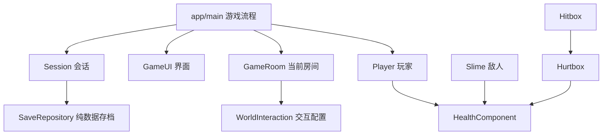

# 架构与编码规范

## 基线

- Godot 4.7.2 标准版 / GDScript / Compatibility / 60 Hz 物理。
- 640×360 基准视口、1280×720 初始窗口；像素纹理使用最近邻。
- 场景与脚本按功能放在一起；配置 `.tres` 与原生 `.tscn` 可在编辑器修改。
- 默认无第三方运行依赖。Python 工具只用标准库；PowerShell 提供 Windows 入口。

## 依赖方向

`main.gd` 只负责加载房间、接线、暂停、复活与保存触发；不承担角色物理或敌人 AI。
子场景向上发信号；HUD 监听生命和进度变化，不每帧查血量。房间通过信号提交交互请求，不直接保存或切换场景。
仅 `Session`、`Audio` 两个 Autoload：跨房间进度和声音。当前玩家读取 Session 已解锁能力，是明确的轻量全局依赖；若增加多玩家再抽取能力组件。

## 场景职责

| 模块 | 职责 | 不负责 |
|---|---|---|
| Player | MOVE/ATTACK/HURT/DEAD 状态、输入、速度、动画选择 | 加载地图、写存档 |
| PlayerConfig | Inspector 可调静态数值；按高度/时间推导重力 | 当前 HP、当前速度 |
| HealthComponent | 扣血、无敌时间、死亡、变化事件 | 镜头、UI、存档 |
| Hitbox / Hurtbox | 碰撞筛选、同一挥击目标去重、传递伤害 | 判定游戏胜利 |
| Slime | PATROL/HURT/DEAD 状态，墙/边缘检测 | 复杂寻路、全局关卡进度 |
| GameRoom | 房间元数据、出生点、附近交互、原生地图 | 直接持久化 |
| SaveRepository | 版本验证、读写、临时文件、备份恢复 | 访问场景节点 |

## 物理与时序

| 层编号 | 名称 | 使用方 |
|---|---|---|
| 1 | World | TileMapLayer、边界；玩家/敌人物体扫描 |
| 2 | Player body | 玩家 CharacterBody2D |
| 3 | Enemy body | 敌人 CharacterBody2D |
| 4 | Player hurtbox | 敌方 Hitbox 扫描 |
| 5 | Enemy hurtbox | 玩家 Hitbox 扫描 |
| 6 | Interaction | 预留；当前用近距离+交互按键选择 |

移动、重力、状态计时与攻击重叠处理在物理帧。渲染只负责背景、动画表现、镜头与 UI。
玩家与敌人实体只扫描世界；接触伤害通过独立 Area2D，不靠实体互相挤压。
攻击区始终监测，只在生效窗口应用伤害；每次 `begin_swing()` 清空命中集合。
暂停时 Main 保持运行以接收恢复输入，Player 和 RoomHost 明确设为 Pausable。

## 命名、类型与变更边界

- 文件/函数/变量使用 snake_case，注册类 PascalCase，常量 UPPER_SNAKE_CASE。
- 导出字段、信号参数、公共方法及核心变量写类型；可明确推断时用 `:=`。
- `@onready` 绑定固定子节点；跨房间使用稳定 room/spawn/ability ID，不保存 NodePath。
- 设计配置只读，运行时实例状态独立；修改共享资源前先复制。
- 节点销毁使用 queue_free；销毁后的异步回调注意有效性。
- 不为两个状态引入通用行为树框架；状态较少时使用枚举和集中转移。
- 修改范围按功能收敛：改变跳跃配置时必须复测平台可达性；改变存档结构时必须设计迁移。
- GDScript 缩进 Tab、UTF-8、LF；引擎生成的长场景行不手工换行。

## 存档契约

`user://progress_v1.json` 保存 version、checkpoint_room、checkpoint_spawn、abilities、visited、completed。
不保存瞬时坐标、当前攻击、敌人实例和当前 HP；恢复时出生在存档点并回满生命。
先写 `.tmp` 并 flush，再保存有效旧文件为 `.bak`，最后替换主文件。校验失败回退备份；不宣称 Windows 文件替换绝对原子。
仅合法房间/出生点/能力 ID 可加载。未来版本拒绝；变更 schema 必须添加迁移和旧版样本测试。

## 原生内容编辑

房间几何已经烘焙为 `TileMapLayer.tile_map_data`，正式运行不依赖 Python 或生成器。
直接在 Godot 编辑 `features/world/rooms/*.tscn`。`create_initial_scenes.py` 和 `bake_initial_rooms.gd` 是首次建库记录，不是日常构建任务，会拒绝覆盖已有内容。
HUD 当前通过脚本组合原生 Control/Container；没有 HTML 或模拟按钮。后续美术频繁编辑时可提取为 `.tscn`。
