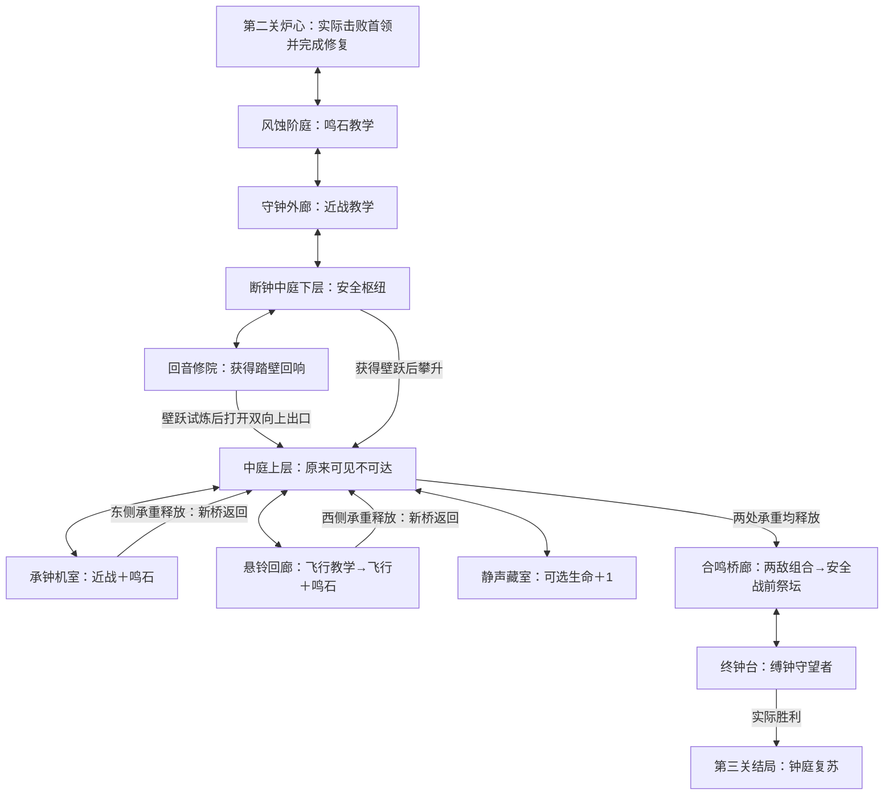

# 第三关设计：失谐钟庭

当前实施顺序见[开发交接](../next-development.md)：先完成双支路与承重回桥，再做可选生命、合鸣桥廊、Boss和主线接线。已有五房间、踏壁辅助、法师比例/技能、铃翼尖啸及三章AI沿用；本设计中的未落地部分继续标为规格，不为换机重新生成已手工编辑的房间。所需本机方法见[Skills清单](../local-skills.md)。

日期：2026-09-27。状态：**九房间规格已明确；壁跃组件、移动测量、两种新敌人、鸣石和五房间前半段独立试玩已实现。完整第三关的双分支、生命奖励、Boss与主线存档接线尚未完成；数值、场景美术与真人难度待验收**。当前实现与启动方式以[前半段试玩说明](chapter_three_preview.md)为准，本文后半章仍为制作规格。

用户要求第三关整体难度高于第二关、场景合理有趣。具体的难度增量、各房间视线/遭遇/回桥规格及已测数值见[场景制作规格](chapter_three_scene_plan.md)。可在编辑器打开`features/world/prototypes/echo_cloister_blockout.tscn`按F6体验本轮能力回环；这是不写存档的独立白盒，Play.cmd仍进入原两章主线。

2026-09-27角色选型定向：采用Evil Wizard 2作为暗影杖使、Monsters Creatures Fantasy 2中的Bat作为铃翼掠食者、Bringer Of Death作为缚钟守望者。原剑士/执戟卫与重槌方案撤回，本文下方已换成对应原图的暗影双式、掠袭和镰击/定点幽魂设计。前两者已接入独立试玩，Bringer仍为Boss阶段的选定原包；详细原帧与比例依据见[动画核验](chapter_three_animation_audit.md)。当前无需再下载角色包。

玩家需求：第三关在前两关基础上逐步提高挑战，拥有独立敌人、Boss、可获得的新能力、生命奖励与探索回环。2026-09-27补充明确：成长奖励是章节主体，不能只增加房间、机关和怪物。

本文九房间中五个已有独立试玩场景；踏壁可在修院实际领取，后半章奖励与Boss仍是设计规格，不代表完整第三关已进入主线。第二关旧档不出Boss的修复及各阶段证据记录于[验证记录](../verification.md)。

## 1. 设计依据与已有基线

- [项目规则](../../AGENTS.md)、[架构](../architecture.md)、[递进规范](../level_progression.md)、[开发经验](../development_lessons.md)优先。
- `level-design`：先测移动范围，再白盒；能力在门槛之前；教学—练习—组合；高压段之间休整；用返回近路证明探索收益。
- `game-design-theory`：把规则对应到玩家决策与成长感；奖励有实际用途，必需与可选收益分开；难度评价看理解和掌握，不追求固定死亡数。
- `game-ai`：独立小型FSM、锁向、墙/边缘检查、可理解的反击窗口；不引入行为树框架或复杂寻路。
- `create-game-assets`：实际盘点课程PNG和工程清单后选择环境；新角色缺口单列，完整动作和游戏内比例先于正式美术接入。
- `save-systems`：新能力、奖励、机关和首领各有独立稳定ID；修复场景不能代替击败首领标记；保留旧收益，测试使用隔离存档。

当前实际能力分布：第一关获得二段跳、冲刺，可选生命之花；第二关获得可选水闸回响护盾；按用户最新确认，历史水道之心也不再增加生命，有第一关生命花的第二关存档统一为6HP。第三关继承已获得的能力，再增加一个真正改变路线的新能力和一份可选生命奖励。本文不移动前两关已经认可的能力位置。

前两关难度参考当前代码与2026-09-27架构补充：第一关是地面国王加独立运行的追踪剑庭；第二关有锁向突进、近身攻击、三连斩、210px升空与2.2秒蓄力后的落地焰浪。旧文档的“裂焰＋锁定喷发”仅是历史版本，不用它低估第三关的起点。

| 已有参数 | 证据 | 本章使用方式 |
|---|---|---|
| 230px/s跑速、约102px单跳 | `default_player.tres`、`player_config.gd`及原物理测试 | 保持；普通台阶以64px为初稿 |
| 二段跳已通过160px高差 | 原关卡输入测试及水闸秘库记录 | 作为已有能力；160px不是测得的理论极限 |
| 冲刺0.18秒、111.6px | 原冲刺物理测试 | 无无敌、空中一次、落地恢复；保持 |
| 玩家剑击0.08/0.13/0.15秒 | `sword_attack.tres` | 一次新按键一手，保持原动作与伤害 |
| 基础5HP、攻击伤害1 | 当前角色/战斗配置 | 主线按5HP、无可选护盾和生命奖励验收 |
| 800×450内部视口、1.4倍镜头 | 当前项目与主场景 | 约571×321世界像素可视；不能把800px当作房间内可见宽度 |

## 2. 核心体验与范围

**从地下水道走上断裂的高庭，学会借墙攀升；在会延迟回鸣的石地上选择落脚点，复位两处承钟机构，穿过重新连通的上层桥廊，击败守钟人。**

探索主题是“看见上路 → 获得壁跃 → 从高处返回同一中庭 → 改变行走路线”。战斗主题是“离开一次攻击，也要安排下一次落脚”。

范围为9个有明确职责的原生房间、1个必得移动能力、1个可选生命奖励、1种环境机制、2种独立普通敌人和1名独立Boss。第三关环境使用课程石材/木梁/拱柱构成开敞高庭；不加入随机地图、装备刷取、新插件或额外Autoload。

## 3. 成长奖励：踏壁回响与钟庭之心

### 必得能力：踏壁回响 / Wall Echo

稳定能力ID拟为 `wall_echo`。位于侧室“回音修院”，**到领奖台只要求现有跑跳**。取得后在标有竖向刻槽的实体墙面旁重新按下 `jump`，蹬离墙面向斜上方跃出。沿用跳跃动作和重绑提示，不增加一排新按键。

- 只对本章明确标记的可蹬墙面生效，不把所有旧地图墙壁自动变成捷径。
- 最新真人反馈修订：向上速度沿用普通跳跃，向外230px/s、贴墙下落封顶80px/s。蹬离后最多0.50秒横向辅助，碰到对墙后0.18秒接续窗口；早按缓冲0.18秒、离墙容错0.14秒/24px。可以保持同一横向方向并连续点跳，不要求每墙快速反向。双侧固定节奏输入均实测6次蹬墙抬升约450px；完整规则及历史差异见最新试玩说明。
- 必须新按键；同一连续墙面每次腾空最多蹬一次。落地或碰到另一面有效墙后才能再次蹬墙；不能在同一面墙反复按键无限升高。
- 蹬墙不补充已消耗的二段跳或空中冲刺，不提供无敌、不伤害敌人、不取消剑击收招。沿用受伤、死亡、切房和菜单清理输入规则。
- 首次获得回满生命并保存，这是唯一能力奖励；重复领取和普通保存都不回血。
- 修院先教一面低墙蹬到宽平台，再教两面墙交替，最后从上出口回到中庭。下面始终有接落地面；西侧原入口始终可退回。
- 两条主线支路用壁跃进入上层，再用平地/宽台战斗；第一次练壁跃时没有敌人或鸣石。Boss房允许用指定侧墙换位，但普通跑跳也能躲过每一招。

**本轮测量**：真实60Hz完整单跳97.40px、短按39.31px；采样第二次按键时机的二段跳最高194.41px；二段跳/冲刺水平362.71px。净宽128px两墙仅用壁跃可抬升447.49px；原生白盒448px高出口用8次蹬墙实走通过，旧双跳/冲刺未能绕过。已测两向起跳、同墙防重复、空中次数不重置、普通墙/未解锁、滑墙、菜单/受伤、攻击不可取消、暂停、实际护盾与回环返回。撞顶/墙角、更多输入时机/宽度、正式关卡路线和真人体验继续补测，不把采样最大值称为理论极限。448px连续段是压力验证，正式教学拆短段与中继台。

### 可选奖励：钟庭之心 / Belfry Heart

稳定标记拟为 `bell_heart`。位于“静声藏室”：交替壁跃、二段跳和一次空中冲刺的可选路线，**没有敌人，失足落回安全下层**。终点永久生命上限+1并回满生命，领取一次后保存、隐藏，死亡/读档继续有效。入口能看到奖励或清楚的生命纹章，避免玩家先走难路才知道收益。

主线不要求领取；本章和后续关卡不能以已经拿到它为默认。保留第一关生命花；第二关新旧护盾均不加生命。取得第一关生命花后以6HP进入第三关，再领取钟庭之心才升到7HP；缺少生命花时仍按实际奖励计算。

## 4. 地图、门槛与回环

图中中庭上下层属于同一原生房间；重复画支路与回桥是表达两条实际路线，不增加隐藏房间。Boss战期间H↔I的返回端关闭，胜利后恢复。第三关右侧为章节结束交互，后续章节未实现时不做通往空场景的可用出口。

| 房间 / 拟用ID | 空间与职责 | 进入、返回和收益 |
|---|---|---|
| 风蚀阶庭 `windworn_steps` | 宽阶梯、破拱和远处断钟；入口祭坛；单个鸣石，两侧普通地面，无敌人 | 西端返炉心，东端到外廊；不会在出生点触发机关 |
| 守钟外廊 `bell_guard_walk` | 单只暗影杖使宽地教学：先暗影上挑、完整收招后再教回卷；第二只隔开练习，不夹击 | 西返阶庭，东到中庭；首次清场开启通向枢纽的门并保存 `bell_guard_passed` |
| 断钟中庭 `broken_bell_atrium` | 下层祭坛、中央断钟、清楚可见的上层断桥；首次无敌人 | 西侧低门接外廊，东侧低门接修院；壁跃返回上层后开放两支路与可选藏室 |
| 回音修院 `echo_cloister` | 常规64px台阶到能力台；单墙、交替墙两段安全练习 | 西侧低门接中庭下层；高门开闩后永久双向连接中庭上层，并保存 `wall_passage_open` |
| 承钟机室 `counterweight_workshop` | 宽落脚平台、暗影杖使＋一组鸣石；壁跃移动段与战斗段分开 | 中庭东侧上门进入西端；终点释放东承重，开另一条高桥回中庭；奖励回血/保存一次 |
| 悬铃回廊 `hanging_gallery` | 飞行敌人先在连续地面单独教学，后段才组合一组鸣石 | 中庭西侧上门进入东端，按向西的地标引导；释放西承重后从另一条高桥返回；奖励回血/保存一次 |
| 静声藏室 `quiet_reliquary` | 无战斗、显著生命纹章；高精度组合位移，安全接落层 | 中庭上层内门往返；领取钟庭之心后开启室内下行近路，直接回原入口 |
| 合鸣桥廊 `confluence_bridge` | 两承重释放后中庭中央桥真正接通；前段两敌组合，后段彻底安全 | 西端返中庭；东端安全祭坛再进Boss；重试路不穿过已打过的遭遇 |
| 终钟台 `bell_tribunal` | 固定单屏、完整地板、指定侧墙、无自动鸣石或小怪 | 左进左返，战斗锁真实边界；胜利右侧出现章节结束交互 |

**双支路顺序**：先机室或先回廊都可完成。暗影杖使、鸣石、壁跃的共同教学在分支前；飞行怪教学放在回廊内部，合鸣桥必须等两支路都完成，因而不能先遇到未知飞行怪组合。

**开桥确实改变路线**：每支路终点打开的是跨过已完成危险区的独立高桥，需能从出口直接回到中庭上层；两桥都开放后中央桥接到终局。已开桥两端可走、可见、可存档，返回不再重复整条战斗路。桥在安全交互后改变状态，不能在玩家脚下撤掉碰撞或生成夹人实体。

逐门建立 `source_room / door_id / target_room / spawn_id / direction / required_flags` 表后再做场景。左右门和出生方向与上表一致；高低层门有不同名字与地图锚点。地图显示上下层、能力门、两座已开桥、已知奖励与当前目标；未探索区域仍隐藏名称。每个双向连接必须两端实走。

## 5. 新环境机制：鸣石

鸣石是踏上后延迟回鸣的实体石板。它教“脚下即将再危险，落脚要留余地”，不同于第二关按全局时钟循环的蒸汽。

| 阶段 | 白盒候选 | 规则 |
|---|---|---|
| 静息 | 无限等待 | 未踩到不自行喷发；用可辨石纹提示其身份 |
| 触发/预警 | 0.90秒 | 玩家进入触发区后该板计时；石纹发亮、局部振动及声音；离开不会取消计时 |
| 回鸣 | 0.30秒 | 64px宽、48px高的真实上冲危险；伤害1；可跳过或移到普通地面 |
| 冷却 | 1.40秒 | 无伤害；需冷却完成且玩家离开触发区后才能再触发 |

单块从中心撤到板外所需的距离，必须用玩家碰撞体和加速后的实测位移验证；不能只用230×0.9估算宣称安全。第一块前后至少各128px安全地面，落点宽至少96px。主线相邻板之间至少96px普通地面作为初稿；尚未测水平跨越极限，不先把连续缺口填满。

首次教学在无敌人的安全地面，可边缘触发后撤观察。后续每次只加一种已认识的压力；同一遭遇最多两块受同一节奏控制的板，不做四面同时喷发或屏外触发。第三关通关后永久停用环境鸣石，Boss攻击回鸣仅由战斗实例负责。

一轮回鸣对同一玩家只结算一次，护盾挡住后不能在剩余帧补伤。下一轮/另一块仍是独立攻击。墙体阻挡危险，平台上、边缘、高速经过与初始重叠均实测。装饰光晕不算伤害，危险结束同时关闭碰撞。暂停冻结，切房/死亡清理，重进从安全静息开始。

## 6. 独立敌人阵容

三个原包都已到手，完整静态联系表已查看；原图动作核对和合成比例对照不等于Godot内动态验收。普通敌人伤害候选统一为1。第三关小怪增加招式辨认和空间压力，保留完整预警，不通过大量刷怪或堆血量实现升级。

### 暗影杖使 / Bell Invoker

拟用ID `bell_invoker`，配置 `InvokerConfig`，选用Evil Wizard 2。细长长杖、橙色衣缘与大幅暗紫攻击区别于前两关剑士；打法是辨认两种施法起手和攻击空间，而非追近后反复挥剑。候选4HP、步行65px/s；4HP不是难度提升的主要来源。

| 招式 | 实际原帧（0起算） | 候选准备 / 生效 / 收招 | 玩家决策 |
|---|---|---|---|
| 暗影上挑 | Attack1 0–2收杖蓄势，3–6向前上展开，7结束 | 0.85 / 0.32 / 1.10秒 | 斜上空间危险，不能习惯性向前跳进攻击；留在弧外地面，等收招接近。安全退距按实图和真实碰撞测量 |
| 暗影回卷 | Attack2 0–3高举长杖，4–6前方回卷，7结束 | 1.05 / 0.30 / 1.25秒 | 辨认更长的举杖，先退开；越身路线只有实测不接触身体/法术后才作为可选解，不承诺跳跃必躲 |

第一次遭遇固定先上挑，完整收招后再回卷；两招分别辨认，不连招、不加鸣石。以后根据距离和上次招式选择，同一招最多连续两次。每次施法开始锁定朝向，本轮不转身、不滑着追击、不追加追踪弹。两招每次都保留完整反击窗口，和蝙蝠组合时也不消掉收招。预警可以被玩家真实剑击打断；用合理遭遇距离和威胁覆盖表现精英感，不临时加无敌防止玩家打断。

Attack1/Attack2原图法术与本体在同一张图，不是可拆出的完整飞行弹动画，不把整条暗影弧当成自动追踪弹。身体之外的伤害形状由各生效帧的实心法术轮廓分别校准；不以透明画布或整幅包围盒作为伤害区，不为做可跳过判定而忽略图中仍危险的高处。两招释放时都须在镜头内完整可见，背后有安全退路；距离过远只接近，不从屏外出招。

### 铃翼掠食者 / Bell Skimmer

拟用ID `bell_skimmer`，选用Monsters Creatures Fantasy 2/Bat。候选2HP；盘旋→收翼锁点→斜向掠袭→低空停留，给玩家一次空中威胁与追击窗口，不无限悬在近战范围之外。

- `fly` 0–10盘旋；`attack` 0–7由展翼到收翼，分配0.90秒完整预警；锁点后不再跟踪。
- `attack` 8–9有扑击弧，绑定真实掠袭生效段；候选260px/s，最多0.45秒，墙体/最大行程提前终止。速度、行程和画面须同一物理时钟，不能动作已结束仍有不可见武器伤害。
- `attack` 10结束，回到低位`fly`循环收招1.20秒。不是伪造原包有“落地休息”动画；飞行高度必须让玩家可站在身体外挥剑命中。
- `hurt`用于受伤；`fly-to-fall`→`fall`→接触地面后`death`用于死亡，不拿失控坠落动画当主动俯冲。初始教学有连续实地与可见落点，不跨即死坑。
- 第一段认识单只，后段才加一块已学鸣石；不加未获得素材的音波、分身或追踪群弹。

### 组合和伤害契约

外廊教杖使两种姿势；机室杖使加单块鸣石，落脚与退路都须通过5HP无盾实测；回廊先教蝙蝠再配鸣石；合鸣桥最多一名杖使加一只蝙蝠，不再叠鸣石。组合开始时错开起手，不能让玩家进门立刻被两次命中；随后两个FSM正常工作，若形成不可避的交叉覆盖先改站位与起手间隔。

每次新攻击先检查距离、视线、墙、边缘和可见区域。普通敌人死亡/失去目标立即停止自己的招式；暂停冻结、切房清理。身体接触始终走真实伤害链路：身体与同次法术/掠袭共享去重，护盾抵挡后残留不能补伤；下一次独立攻击才重建判定。收招是可反击窗口，不代表身体可以无伤穿过。复用Health/Hitbox，不复用旧剑士AI换图。

## 7. Boss：缚钟守望者 / Bound Bell Warden

采用Bringer Of Death，身份改为**镰刃守位＋锁定旧位置的定点幽魂**。镰刀近身施压，幽魂迫使玩家离开旧站位，第二阶段检验移动后还能否保留退路。完整原包有Attack、Cast和独立Spell；没有重槌、跳跃、瞬移或召唤小兵专用动画，不编造对应动作。

候选14HP、伤害1。普通剑击可伤害Boss但不取消出招；转阶段等当前攻击与幽魂结束。站在地面战斗，不复制第一关追踪剑庭或第二关升空下砸火墙。

| 招式 | 实图映射（0起算） | 候选节奏与约束 |
|---|---|---|
| 缚魂镰 | Attack 0–3抬镰、4–7挥出与延展、8–9消散收势 | 0.90秒准备、0.32秒生效、1.10秒收招；准备锁向，攻击中不追步。实心刃弧与身体独立校形，共享本次伤害去重 |
| 定点幽魂 | Cast 0–3蓄势、4–7举手释放、8结束；独立Spell 0–15 | 施法0.85秒后在当时玩家脚下的可用地面锁定位置；上方出现真实小型旋涡，0–3持续0.90秒无伤害提示；4–5幽魂伸出0.15秒，6–12实体危险0.42秒，13–15消散0.25秒。渲染和命中须逐帧同源校准；本体等完整效果结束后再留0.90秒反击 |
| 幽魂与镰（仅第二阶段） | 同一套Cast/Spell，追加一套完整Attack | 单个幽魂开始预警后0.35秒，再开始完整0.90秒抬镰；旧位置幽魂与本体一次攻击形成短重叠。所有危险结束后至少1.30秒收招；安全条件不满足则取消追加，只完成幽魂 |

Spell原图是**上方旋涡伸下幽魂**，不是从地板上冲的岩石。视觉锚定固定地面、保持原图方向，危险高度/宽度依据所选原帧和倍率确定，不能套旧“96×48回鸣”矩形。预警只表现实际召唤旋涡，不画未来命中框、攻击轨迹或文字解法。位置锁定以后不追着玩家移动；禁止在墙体内、屏外或不可见平台后生成。

第一阶段先分别展示两招。半血后安全转阶段1.20秒，才解锁组合；转阶段可用Idle与材质/声音，不宣称有专属动画。任何时刻最多一个幽魂区加一次本体攻击；幽魂的完整生命周期只伤同一目标一次，本体镰击是另一个明确攻击ID，护盾可以挡其一但不能自动替玩家挡下一次独立攻击。

组合判定必须在追加前检查玩家贴边、背后退路、墙体、幽魂位置及剩余预警；不能站到玩家唯一退路上再无条件追加。先以合法站位区和真实输入验证安全解，不建立通用AI框架。同一招最多连续两次；组合后至少两次独立单招才再允许组合。目标过远步行接近，禁止长距离无提示突进。

固定1.4倍单屏、完整地板和可见实体边界；保留指定侧墙供壁跃换位，每一招仍有普通跑跳可行解。不放环境自动鸣石、小怪或即死坑；战前祭坛到门目标≤6秒且无敌人，目标与实测分开。HUD仅血条和阶段，静音/减少闪光模式也能读出姿势与幽魂旋涡。

胜利独立保存 `bell_warden_defeated`、恢复生命并打开左右门；右侧交互完成 `bell_court_restored` 后停用环境鸣石、显示本章结局。之后可自由回访；独立Boss挑战不写主线。测试覆盖身体接触、盾去重、平台边缘、薄墙、高速移动、镜头四边、双向壁跃、转阶段和同帧死亡。

## 8. 难度递进与恢复预算

表中1–5是本章设计强度标签，不是玩家测试分数，也不意味着新章入口一定比上一章Boss难。

| 节拍 | 强度 | 本次只增加什么 | 休息 / 收益 |
|---|---:|---|---|
| 风蚀阶庭 | 1 | 单个鸣石延迟节奏 | 入口祭坛、安全观察地面 |
| 守钟外廊 | 2→2.5 | 一种近战；第二只分开练习 | 战斗间空地、通往安全中庭 |
| 回音修院 | 1→2 | 新能力，无敌人/危险 | 领能力回血、宽接落台、上层近路 |
| 首条支路 | 3 | 熟悉敌人＋鸣石，或飞行怪单独教学后再组合 | 入口安全祭坛；承重机关回血、回桥 |
| 中庭返回 | 1 | 从高处辨认原来走过的路线 | 安全、目标更新、自由选择支路 |
| 第二条支路 | 3→3.5 | 将已经练过的换位节奏应用到另一种敌人 | 独立机关奖励、中央桥接通 |
| 静声藏室（可选） | 操作4、战斗0 | 壁跃/双跳/冲刺组合精度 | 失足安全，永久生命+1 |
| 合鸣桥廊 | 4 | 暗影杖使＋飞行怪，最多两名活动敌人 | 前后有安全地面，最后战前祭坛 |
| Boss第一阶段 | 4 | 镰击与定点幽魂分别检验姿势和旧站位判断 | 每招完整反击窗口 |
| Boss第二阶段 | 5 | 单个定点幽魂＋一次本体镰击 | 保留预警与安全收招 |

合鸣桥廊不再叠鸣石：两敌已经占满两种同时威胁。高难壁跃与战斗也分段，主线不同时要求极限跳跃、鸣石躲避和空地夹击。强度递进是总体波浪式上升，两条支路可任意顺序，不声称先后顺序固定。

两条支路使用固定配置，不因访问先后暗改伤害、预警或怪物数量；表中的3→3.5是各支路内部从单项到组合的共同范围。第二次返回中庭时的推进感来自两座桥连成完整上层路线。

基础5HP下一段主要挑战到下一次唯一奖励之间设计为1–2个遭遇单元；先观察伤害来源再调站位、距离与敌人摆放。祭坛只保存不回血。踏壁回响、两个承重机关、可选生命、Boss胜利可各有一次明确的独立回血；不可重复刷奖励回血。长段消耗过高时缩短高压段、提供可靠退让空间，不给测试人物加血或无敌。

## 9. 美术依据与缺口

三个角色包都已收到，不需要用户重复下载。原包完整动作检查、尺寸/透明边距测量、SHA-256与800×450合成比例对照已完成，见[素材盘点](chapter_three_assets.md)与[动画核验](chapter_three_animation_audit.md)。合成图明确标记非游戏截图，不能替代实际Godot渲染或玩法验收。

课程砌石、拱柱、堡垒轮廓与木梁继续构成开敞高庭。三项区别于前两章：高处天空背景与细高断柱；跨空木石桥与分层中庭；断钟和承重机关地标。不重用第一关现有小房间 `belfry` 作为第三关地图。

暗紫法术与深红蝙蝠在第二关深色石墙上对比偏低，静态对照已发现；战斗区优先采用开敞中灰蓝天空和低细节远景，不在它们后方堆深色花纹。原图像素和已认可主角保持不变，不用扩大光晕掩盖轮廓。最终导入仍须在深/浅背景、移动镜头和减闪模式实测。

| 资产族 | 当前依据 | 实施前剩余工作 |
|---|---|---|
| 地形与背景 | 课程图块可用 | 白盒实测后编辑独立原生TileSet/TileMapLayer |
| 断钟、承重装置、刻槽墙 | 尚未确认完整原图 | 用已有环境/道具核对具体选区和剪影，不把白盒占位标成完成美术 |
| 鸣石 | 历史岩石效果与课程尘土候选 | 检查四阶段和危险形状；Boss独立Spell不能直接充作从地面喷出的石头 |
| 暗影杖使 | Evil Wizard 2完整动作，包内CC0声明 | 原生帧资源、两个攻击区逐帧校准、动态比例和深背景可读性 |
| 铃翼掠食者 | Bat完整飞行/攻击/受伤/死亡；作者页许可依据已缓存 | 低空收招可反击范围、左右朝向、死亡落地衔接 |
| 缚钟守望者 | Bringer完整Attack/Cast/Spell等；包内许可已读 | 本体/独立幽魂锚点、固定地面锁点、转阶段和动态攻击映射 |
| 玩家壁跃 | 现有跳跃/转向帧优先 | 核对蹬墙姿势和脚底尘土，不改变原剑击 |

原静态比例初选为杖使Sprite 5/7、蝙蝠/Boss 10/7，配合1.4镜头。正式试玩已按用户反馈把杖使改为Sprite 1.0（比初选大40%），脚底锚点保持；蝙蝠保留现有比例，Boss仍为候选比例、待动态核验。原始文件只读；法师/铃翼已登记assets/manifest.json并保留许可、摘要与.import，Bringer仍在本机忽略提交的下载目录，不能视为已随Git迁移或已接入Boss。

## 10. 工程与存档落点

- 环境场景在 `features/world/rooms/`；壁跃组件与只读配置在 `features/player/`；新敌人/Boss在 `features/enemies/`；鸣石在 `features/world/`，组合现有伤害组件。脚本与场景相邻，文件snake_case、类PascalCase。
- 建议配置 `WallEchoConfig`、`ResonantSlabConfig`、`InvokerConfig`、`SkimmerConfig`、`BellWardenConfig`；运行时时钟/去重列表/已用墙ID属于实例，不写共享Resource。
- 玩家在 `_physics_process` 读取InputMap和处理墙体；动画使用同一玩法阶段，不独立产生伤害时钟。事件如 `counterweight_released`、`passage_opened`、`defeated` 由父房间/主场景接线。
- 延续schema 2的字段形状，实施时扩展白名单：9房间、能力 `wall_echo`、标记 `bell_guard_passed` / `wall_passage_open` / `east_weight_released` / `west_weight_released` / `bell_heart` / `bell_warden_defeated` / `bell_court_restored`。只有实际改字段才升schema并写迁移；不在设计阶段先向运行代码塞空房间ID。
- 生命上限从已有唯一奖励标记加 `bell_heart` 推导，不持久化瞬时HP，不把已有生命奖励换成新奖励或删除旧标记。
- 章节入口要求 `furnace_keeper_defeated` 和 `cistern_restored`。旧档仅修复水道不算新Boss胜利；本轮修复保证可以继续挑战而保留旧收益。
- `Session`维护进度、`JourneyProgress`推导目标、地图跟随已探索/能力/桥状态；第三页要支持回切前两章，未知房间不提前揭名。
- 门与桥加载时按唯一标记重建稳定状态；存档只写 `user://`，沿用临时文件、备份与校验，测试只用 `user://test_*`。保存失败保留本次收益、明确提示、允许祭坛重试；不能显示“已保存”或返还已消费奖励。
- 原生房间生成一次后进入手工编辑；制作工具拒绝覆盖已存在场景，保留UID/import元数据。副作用不能扩展到已认可的前两章地形与玩家基础数值。

## 11. 实施顺序与验收

1. **测能力**：隔离试验场实测壁跃及未解锁组合极限；锁定参数后才确定竖井/平台坐标。第一次门槛只能验证壁跃，不能同时要求极限冲刺。
2. **做能力闭环白盒**：中庭下层→修院取得能力→安全练习→上层返回；证明有能力可达、无能力不可绕过且永远能退回。
3. **做独立敌人和鸣石**：单只教学、相同攻击去重、接触伤害、护盾、死亡/切房/暂停；完成一间代表房的素材与比例目标再批量铺美术。
4. **完成两支路与可选奖励**：两种顺序实走、领奖与回桥双向通行、能力重新打开旧视线、5HP无盾主线、生命可选路线。
5. **完成桥廊和独立Boss**：先单招后组合；全部边缘站位有正常输入的避让解；固定可见边界、无提前出口、真实胜利唯一保存。
6. **跨章接线与回归**：第二关新档/历史仅修复档/真实击败档分别验证；能力/生命/桥与三章结局跨进程恢复；回忆挑战不写主线。

每个行为变更执行 `tools/check.ps1`；涉及玩家移动、共享战斗、存档或章节流程执行 `tools/check.ps1 -Full`；视觉改变追加 `-Visual` 并实际打开截图。新增第三关默认入口前必须同步门禁范围，保留前两章全量路线。

验收分层：

- [ ] 组件：壁跃解锁/无解锁、同墙滥用、双跳冲刺次数、真实碰撞/高台/薄墙、护盾去重、时钟同步、清理。
- [ ] 关卡：能力先于门槛，两种支路顺序，所有门双端出生点、回桥、可选奖励、两方向壁跃实测。
- [ ] 存档：旧收益、仅修复不等于Boss胜利、保存失败、备份恢复、跨进程、唯一奖励。
- [ ] 连续路线：5HP无可选盾/生命完成主线；另一条实际领取可选奖励；输入驱动，不传送/注入状态凑过关。
- [ ] 视觉：原生800×450读图、角色完整动作、鸣石各阶段、壁跃落点与镜头、Boss双方边界、中英文/重绑、减少闪光。
- [ ] 真人：记录首次看懂机关/壁跃所需尝试、迷路与原路折返、主要受伤来源、第二关到第三关的体感提升、奖励是否值得；自动0死亡不能代替此项。

当前阶段新增证据见[前半段试玩说明](chapter_three_preview.md)及[验证记录](../verification.md)：两敌已导入，五个房间和鸣石/壁跃返回路线可玩；其余双分支、生命奖励、Boss与章节存档仍待完成。原白盒的45项图形检查、前两章的662/804项与新增前半段路线分别记录，不能据此声称完整第三关已交付或真人难度已高于第二关。
